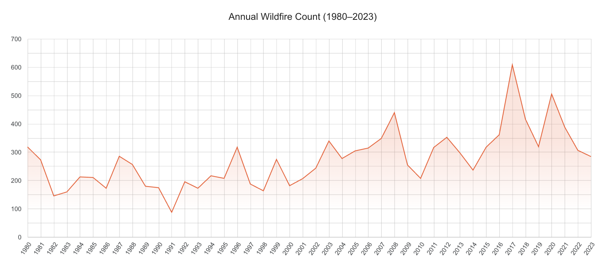
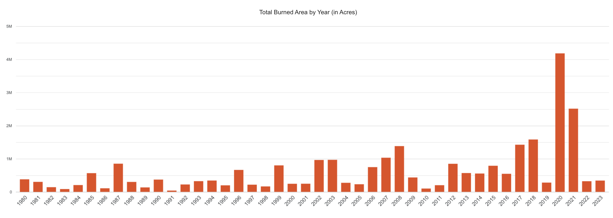
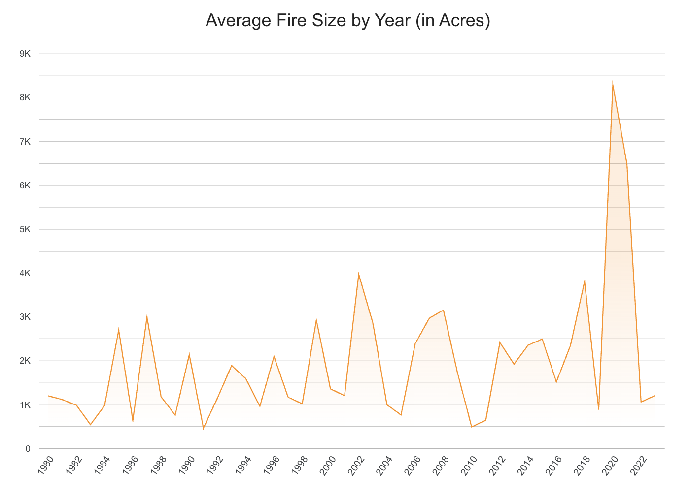
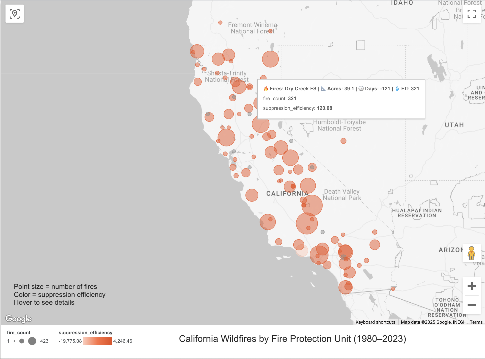

# california-wildfire-analysis
SQL and Looker portfolio project analyzing California wildfire data

# California Wildfire Data Analysis

This is a data analytics portfolio project using real open data on California wildfires. The project demonstrates my skills in:

- SQL (joins, subqueries, window functions)
- Data modeling and cleaning
- Google Looker Studio dashboard creation

The goal is to uncover insights into wildfire trends, damage, and geographic patterns, similar to those handled by CAL FIRE analysts.

## Tools Used
- DB Browser for SQLite (SQL engine)
- Google Looker Studio (interactive dashboard)
- GitHub (project documentation and version control)

## Step 1: Project Setup

This GitHub repository contains all files related to the project. It includes:

- Source data in CSV format
- SQL scripts used to analyze and clean the data
- Google Looker Studio dashboard file
- Final report and insights

In this step, we created this GitHub repository and added this README file to track all work.

## Step 2: Data Source and Import

We used the official California state open data portal to obtain wildfire perimeter data from 1950 to present.

- Source: https://data.cnra.ca.gov/dataset/california-fire-perimeters-all
- File used: California_Fire_Perimeters_(all).csv

We renamed the file to `wildfires.csv` and imported it into a new SQLite database called `wildfire_analysis.db` using DB Browser for SQLite.

The imported table is called `wildfires`. This table contains information on the location, size, date, and causes of wildfires across California.

We identified 77 records with missing year values and excluded them from further analysis to ensure accurate time-based trends.

We identified year values ranging from 1878 to 2023. However, older records (before 1980) are sparse and less consistent. Therefore, we decided to limit our analysis to the period from 1980 to 2023 to ensure more accurate and actionable insights.

## Step 3: Yearly Fire Summary (1980–2023)

To better understand the recent history of wildfires, we focused our analysis on data from 1980 to 2023. The query below calculates:

- The number of wildfire events per year
- The average size of fires in acres
- The total burned area per year

```sql
SELECT 
  YEAR_ AS year,
  COUNT(*) AS fire_count,
  ROUND(AVG(GIS_ACRES), 2) AS avg_fire_size_acres,
  ROUND(SUM(GIS_ACRES), 2) AS total_burned_acres
FROM 
  wildfires
WHERE 
  YEAR_ >= 1980
  AND YEAR_ <= 2023
  AND GIS_ACRES IS NOT NULL
GROUP BY 
  YEAR_
ORDER BY 
  YEAR_ ASC;
```

We saved the result of this query as `yearly_fire_summary.csv` and placed it in the `data/` folder for use in Google Looker Studio.

## Step 4: Visualization in Looker Studio (Google Data Studio)

We used Google Looker Studio to visualize the data from `yearly_fire_summary.csv`. The first chart shows how the number of wildfires changed year by year.

### Chart 1: Annual Wildfire Count
- Type: Line chart
- Dimension: `year`
- Metric: `fire_count`
- Title: *Annual Wildfire Count (1980–2023)*

This chart helps identify trends in wildfire frequency and detect periods of increase or stability.

### Chart 2: Total Burned Area by Year
- Type: Column chart
- Dimension: `year`
- Metric: `total_burned_acres`
- Title: *Total Burned Area by Year (in Acres)*

This chart shows the total amount of land burned in California each year, helping to visualize the severity of fire seasons over time.



### Chart 3: Average Wildfire Size by Year
- Type: Line chart
- Dimension: `year`
- Metric: `avg_fire_size_acres`
- Title: *Average Wildfire Size by Year (Acres)*

This chart visualizes how the average size of a wildfire changed over time, helping assess whether individual fire events have become larger or smaller over the years.



## Step 5.1: Geographic Fire Statistics by UNIT_ID

In this step, we calculated key wildfire metrics by administrative fire unit (`UNIT_ID`) and joined the results with their geographic coordinates and full unit names.

This dataset will be used to build an interactive map of California in the next step.

### Metrics computed:
- `fire_count` – total number of fires per unit
- `avg_acres` – average burned area (in acres)
- `avg_duration_days` – average duration from alarm to containment
- `suppression_efficiency` – average acres burned per suppression day
- `percent_of_total` – the unit’s share of all fires in the dataset
- `Latitude / Longitude` – geographic coordinates for map visualization
- `UNIT_NAME` – readable name of each fire unit

### Output:
The result was exported to: `data/fires_by_unit.csv`

---

### SQL Query:

```sql
-- Step 6.1: Calculate fire statistics by UNIT_ID and join with geolocation
SELECT
  w.UNIT_ID,
  g.UNIT_NAME,              -- Full name of the fire protection unit
  g.Latitude,               -- Geographic center latitude
  g.Longitude,              -- Geographic center longitude
  COUNT(*) AS fire_count,   -- Total number of fires
  ROUND(AVG(w.GIS_ACRES), 2) AS avg_acres,   -- Average burned area (acres)

  -- Average days from alarm to containment (converted from string to date)
  ROUND(AVG(
    JULIANDAY(REPLACE(SUBSTR(w.CONT_DATE, 1, 10), '/', '-')) -
    JULIANDAY(REPLACE(SUBSTR(w.ALARM_DATE, 1, 10), '/', '-'))
  ), 2) AS avg_duration_days,

  -- Suppression efficiency: total acres divided by total days
  ROUND(SUM(w.GIS_ACRES) / SUM(
    JULIANDAY(REPLACE(SUBSTR(w.CONT_DATE, 1, 10), '/', '-')) -
    JULIANDAY(REPLACE(SUBSTR(w.ALARM_DATE, 1, 10), '/', '-'))
  ), 2) AS suppression_efficiency,

  -- Share of all fires (in %)
  ROUND(
    100.0 * COUNT(*) / (
      SELECT COUNT(*) 
      FROM wildfires
      WHERE GIS_ACRES IS NOT NULL AND ALARM_DATE IS NOT NULL AND CONT_DATE IS NOT NULL
    ),
    2
  ) AS percent_of_total

FROM wildfires AS w

-- Join with unit name and coordinates
JOIN unit_geo AS g
  ON w.UNIT_ID = g.UNIT_ID

-- Filter only valid rows with area and dates
WHERE
  w.GIS_ACRES IS NOT NULL AND
  w.ALARM_DATE IS NOT NULL AND
  w.CONT_DATE IS NOT NULL AND
  w.UNIT_ID IS NOT NULL

GROUP BY w.UNIT_ID;
```

## Step 5.2: Wildfire Map by Protection Unit (1980–2023)

To visualize geographic patterns in California wildfire activity, we used **Google Looker Studio** to build an interactive map with spatial metrics by protection unit.

- 🔘 **Point size** = number of wildfires (`fire_count`)
- 🔘 **Point color** = suppression efficiency (`GIS_ACRES / duration`)
- 📍 Each point is centered on the average location of a `UNIT_ID` area

The map allows us to:

- Identify **high-risk zones** with frequent or large fires
- Evaluate **efficiency** of suppression operations by region
- Visually compare **activity density** across California

### Tooltip (on hover) includes:
- 🔥 Total fires
- 📐 Avg burned area
- 🕒 Avg duration (days)
- 💧 Suppression efficiency (acres per day)




## 🔶 Step 6.1: Wildfires by Cause

In this step, we analyzed the reasons behind wildfires by aggregating the total number of fires, average burned area, and percentage of total for each cause category.

We used a `CASE` block in SQL to convert numeric cause codes into readable labels based on CAL FIRE documentation.

### 🔍 Metrics computed:
- `cause_label` – reason the wildfire started (decoded from the CAUSE column)
- `fire_count` – total number of fires for each cause
- `avg_acres` – average burned area (in acres)
- `percent_of_total` – percentage of all fires caused by this reason

### 💾 Output:
The result was saved to: `data/fires_by_cause.csv`

---

### 🧠 SQL Query (with cause mapping):

```sql
-- Step 6.1: Wildfire statistics grouped by decoded cause label

SELECT
  CASE
    WHEN CAUSE = 1 THEN 'Lightning'
    WHEN CAUSE = 2 THEN 'Equipment Use'
    WHEN CAUSE = 3 THEN 'Smoking'
    WHEN CAUSE = 4 THEN 'Campfire'
    WHEN CAUSE = 5 THEN 'Debris'
    WHEN CAUSE = 6 THEN 'Railroad'
    WHEN CAUSE = 7 THEN 'Arson'
    WHEN CAUSE = 8 THEN 'Playing with Fire'
    WHEN CAUSE = 9 THEN 'Miscellaneous'
    WHEN CAUSE = 10 THEN 'Vehicle'
    WHEN CAUSE = 11 THEN 'Powerline'
    WHEN CAUSE = 12 THEN 'Firefighter Training'
    WHEN CAUSE = 13 THEN 'Non-Firefighter Training'
    WHEN CAUSE = 14 THEN 'Unknown'
    ELSE 'Unclassified'
  END AS cause_label,

  COUNT(*) AS fire_count,                      -- Total fires by cause
  ROUND(AVG(GIS_ACRES), 2) AS avg_acres,       -- Avg burned area
  ROUND(
    100.0 * COUNT(*) / (SELECT COUNT(*) FROM wildfires WHERE GIS_ACRES IS NOT NULL),
    2
  ) AS percent_of_total                        -- Share of total fires
FROM wildfires
WHERE GIS_ACRES IS NOT NULL AND CAUSE IS NOT NULL
GROUP BY CAUSE
ORDER BY fire_count DESC;
```


